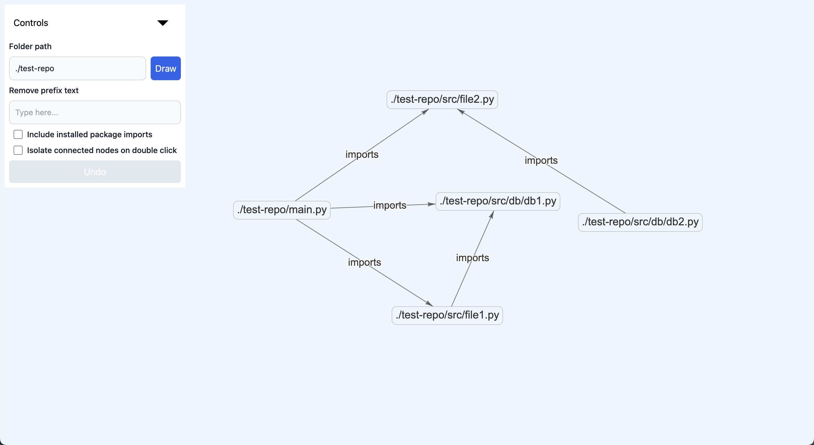
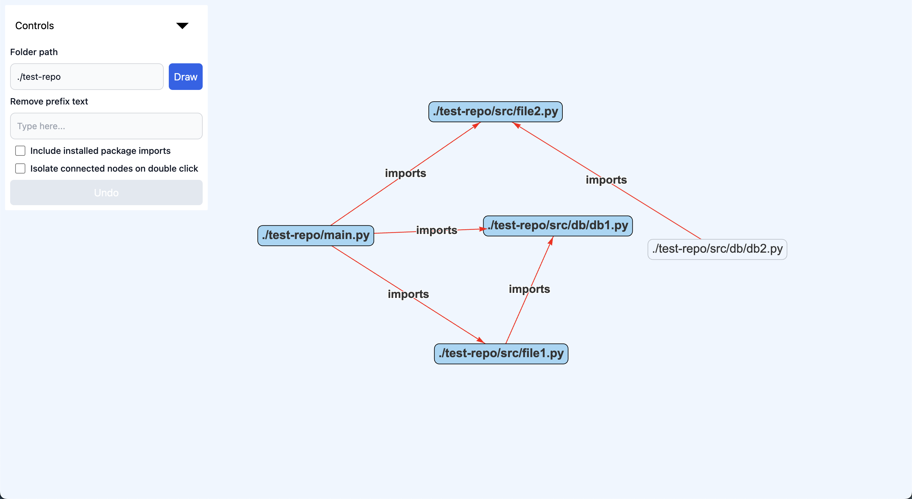
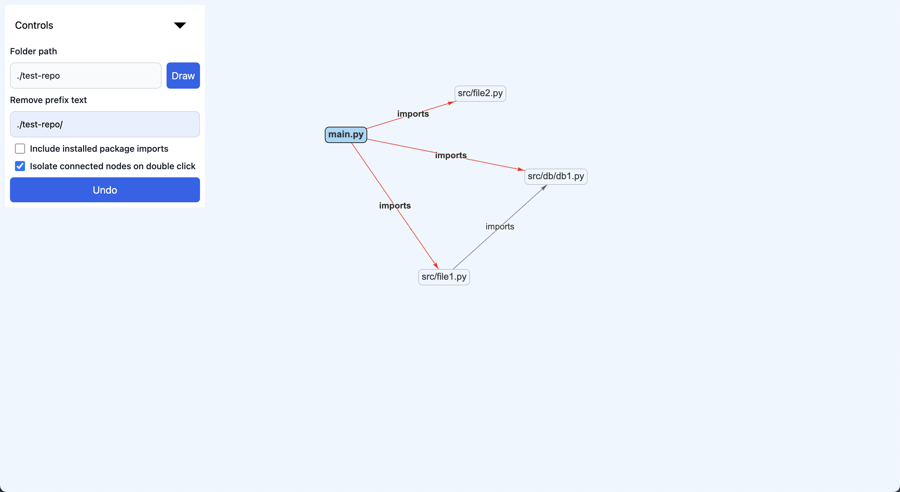

# File Imports graph maker
An application that parses your code to create an interactive graph of all file imports.

## How to run the app?
1. Create python environment
    ```sh
    conda create --name graph-maker python=3.12.3
    # activate
    conda activate graph-maker
    ```
2. Install dependencies
    ```sh
    pip install -r requirements.txt
    ```
3. Run the server
    ```sh
    python main.py
    ```
4. Visit [localhost:8000/index.html](http://localhost:8000/index.html)

### Preview Images






## Contributing
## Setup environment
### Backend
1. Create environment
    ```sh
    conda create --name graph-maker python=3.12.3
    # activate
    conda activate graph-maker
    ```
2. Install dependencies
    ```sh
    pip install -r requirements.txt
    ```
### Frontend
Go to `/graph-renderer-js`
```sh
cd /graph-renderer-js
```
then
```sh
npm install
# or
pnpm install
```

## Run
### Backend
At project root run 
```sh
python main.py
```

### Frontend
At `/graph-renderer-js` run
```sh
pnpm run dev
# or
npm run dev
```